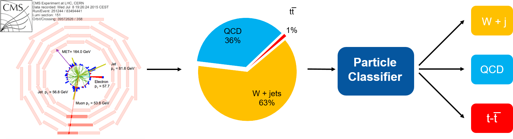
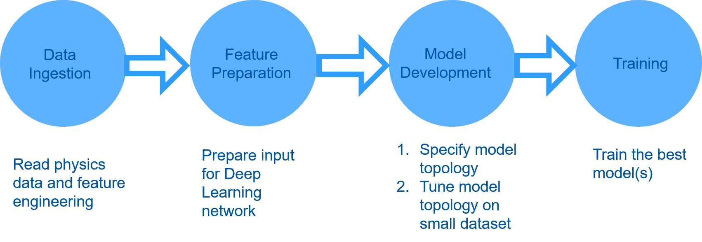
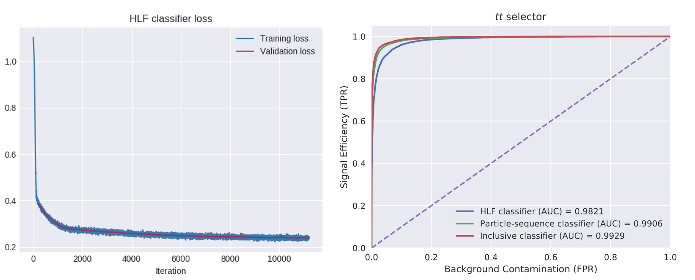

# SparkDLTrigger - Particle Classifier using Deep Learning and Spark
Welcome to the SparkDLTrigger repository! This project focuses on building a machine learning pipeline for 
a high-energy physics particle classifier using Apache Spark, ROOT, Parquet, TensorFlow, and Jupyter with 
Python notebooks.

## Related articles and presentations
This project is supported by several articles and presentations that provide further insights and details. Check them out:

- [Machine Learning Pipelines with Modern Big Data Tools for High Energy Physics](https://rdcu.be/b4Wk9)
 *Comput Softw Big Sci* **4**, 8 (2020).
- Blog entries:
  - [Machine Learning Pipelines for High Energy Physics Using Apache Spark with BigDL and Analytics Zoo](https://db-blog.web.cern.ch/blog/luca-canali/machine-learning-pipelines-high-energy-physics-using-apache-spark-bigdl)    
  - [Distributed Deep Learning for Physics with TensorFlow and Kubernetes](https://db-blog.web.cern.ch/blog/luca-canali/2020-03-distributed-deep-learning-physics-tensorflow-and-kubernetes)

## Physics Use Case
The project focuses on a particle classifier that enhances the accuracy of event selection in high-energy physics. 
By utilizing neural networks, we can classify different event topologies of interest, thereby improving the state
of the art in accuracy. This work reproduces the findings of the research article
[Topology classification with deep learning to improve real-time event selection at the LHC](https://link.springer.com/epdf/10.1007/s41781-019-0028-1?author_access_token=eTrqfrCuFIP2vF4nDLnFfPe4RwlQNchNByi7wbcMAY7NPT1w8XxcX1ECT83E92HWx9dJzh9T9_y5Vfi9oc80ZXe7hp7PAj21GjdEF2hlNWXYAkFiNn--k5gFtNRj6avm0UukUt9M9hAH_j4UR7eR-g%3D%3D)
and implements it using tools from the Big Data ecosystem, such as Apache Spark and TensorFlow/Keras APIs at scale.

## Authors  
- Authors and contacts: Matteo.Migliorini@cern.ch, Riccardo.Castellotti@cern.ch, Luca.Canali@cern.ch    
- Original research article, raw data and neural network models by: [T.Q. Nguyen *et al.*, Comput Softw Big Sci (2019) 3: 12](https://link.springer.com/epdf/10.1007/s41781-019-0028-1?author_access_token=eTrqfrCuFIP2vF4nDLnFfPe4RwlQNchNByi7wbcMAY7NPT1w8XxcX1ECT83E92HWx9dJzh9T9_y5Vfi9oc80ZXe7hp7PAj21GjdEF2hlNWXYAkFiNn--k5gFtNRj6avm0UukUt9M9hAH_j4UR7eR-g%3D%3D)   
- Acknowledgements: Marco Zanetti, Thong Nguyen, Maurizio Pierini, Viktor Khristenko, CERN openlab, 
members of the Hadoop and Spark service at CERN, CMS Bigdata project,
Intel team for BigDL and Analytics Zoo consultancy: Jiao (Jennie) Wang and Sajan Govindan.

## Project Structure

The project repository is organized into the following sections:
### 1. Download datasets

   Location: [Download datasets](Data)  
   Description: Contains datasets required for the project.  
  
### 2. Data preparation using Apache Spark

   Location: [Data ingestion and feature preparation](DataIngestion_FeaturePreparation)   
   Description: Covers the process of data ingestion and feature preparation using Apache Spark.   

### 3. Preparation of the datasets in Parquet and TFRecord formats  

   Location: [Preparation of the datasets in Parquet and TFRecord formats](Datasets_Final_Preparation)  
   Description: Provides instructions for preparing the datasets in Parquet and TFRecord formats.  

### 4. Model tuning

   Location: [Hyperparameter tuning](Hyperparameter_Tuning)   
   Description: Explains the process of hyperparameter tuning to optimize the model's performance.  

### 5. Model training

   - Location: [HLF classifier with Keras](Training_HLF_Classifier)  
     - Description: Demonstrates the training of a High-Level Features (HLF) classifier using a simple model 
      and a small dataset. The notebooks also showcase various methods for feeding Parquet data to TensorFlow,
      including memory, Pandas, TFRecords, and tf.data.  
       
   - Location: [Inclusive classifier](Training_Inclusive_Classifier)
     - Description: This classifier uses a Recurrent Neural Network and is data-intensive.   
       This shows a case when the training when data cannot fit into memory
   - Location: [Methods for distributed training](Training_Distributed)
     - Description: Discusses methods for distributed training.
   - Location: [Training_Spark_ML](Training_Spark_ML)
     - Description: Covers training using tree-based models run in parallel using Spark MLlib Random Forest, XGBoost, and LightGBM.
   - Location: [Saved models](Models)
     - Description: Contains saved models.

Additionally, you can explore the archived work in the [article_2020](https://github.com/cerndb/SparkDLTrigger/tree/article_2020) branch.  
  
Note: Each section includes detailed instructions and examples to guide you through the process.

### Data Pipelines for Deep Learning

Data pipelines play a crucial role in the success of machine learning projects. 
They integrate various components and APIs for seamless data processing throughout the entire data chain.
Implementing an efficient data pipeline can significantly accelerate and enhance productivity in the core 
machine learning tasks. In this project, we have developed a data pipeline consisting of the following four steps:
1. Data Ingestion

   - Description: In this step, we read data from the ROOT format and the CERN-EOS storage system into a Spark DataFrame. The resulting data is then saved as a table stored in Apache Parquet files.
   - Objective: The data ingestion step ensures that the necessary data is accessible for further processing.

2. Feature Engineering and Event Selection

   - Description: This step focuses on processing the Parquet files generated during the data ingestion phase. The files contain detailed event information, which is further filtered and transformed to produce datasets with new features.
   - Objective: Feature engineering and event selection enhance the data representation, making it suitable for training machine learning models.

3. Parameter Tuning

   - Description: In this step, we perform hyperparameter tuning to identify the best set of hyperparameters for each model architecture. This is achieved through a grid search approach, where different combinations of hyperparameters are tested and evaluated.
   - Objective: Parameter tuning ensures that the models are optimized for performance and accuracy.

4. Training

   - Description: The best models identified during the parameter tuning phase are trained on the entire dataset. This step leverages the selected hyperparameters and the processed data to train the models effectively.
   - Objective: Training the models on the entire dataset enables them to learn and make accurate predictions.

By following this data pipeline, we ensure a well-structured and efficient workflow for deep learning tasks. Each step builds upon the results of the previous one, ultimately leading to the development of high-performance machine learning models.

Machine learning data pipeline

  
## Results and Model Performance
The training of DL models has yielded satisfactory results that align with the findings of the original research paper. The performance of the models can be evaluated through various metrics, including loss convergence, ROC curves, and AUC (Area Under the Curve) analysis.

The provided visualization demonstrates the convergence of the loss function during training and the corresponding ROC curves, which illustrate the trade-off between the true positive rate and the false positive rate for different classification thresholds. The AUC metric provides a quantitative measure of the model's performance, with higher AUC values indicating better classification accuracy.

By achieving results consistent with the original research paper, we validate the effectiveness of our DL models and the reliability of our implementation. These results contribute to advancing the field of high-energy physics and event classification at the LHC (Large Hadron Collider).

For more detailed insights into the experimental setup, methodology, and performance evaluation, please refer to the associated documentation and research article.
The results of the DL model(s) training are satisfactoy and match the results of the original research paper. 

## Additional Info and References
- [Article "Machine Learning Pipelines with Modern Big DataTools for High Energy Physics"](https://rdcu.be/b4Wk9) *Comput Softw Big Sci* **4**, 8 (2020), and [arXiv.org](https://arxiv.org/abs/1909.10389)
- [Blog post "Machine Learning Pipelines for High Energy Physics Using Apache Spark with BigDL and Analytics Zoo"](https://db-blog.web.cern.ch/blog/luca-canali/machine-learning-pipelines-high-energy-physics-using-apache-spark-bigdl)
- [Blog post "Distributed Deep Learning for Physics with TensorFlow and Kubernetes"](https://db-blog.web.cern.ch/blog/luca-canali/2020-03-distributed-deep-learning-physics-tensorflow-and-kubernetes)
- [Poster at the CERN openlab technical workshop 2019](Docs/Poster.pdf)  
- [Presentation at Spark Summit SF 2019](https://databricks.com/session/deep-learning-on-apache-spark-at-cerns-large-hadron-collider-with-intel-technologies)  
- [Presentation at Spark Summit EU 2019](https://databricks.com/session_eu19/deep-learning-pipelines-for-high-energy-physics-using-apache-spark-with-distributed-keras-on-analytics-zoo)
- [Presentation at CERN EP-IT Data science seminar](https://indico.cern.ch/event/859119/)

