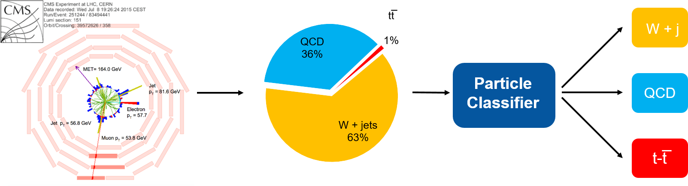
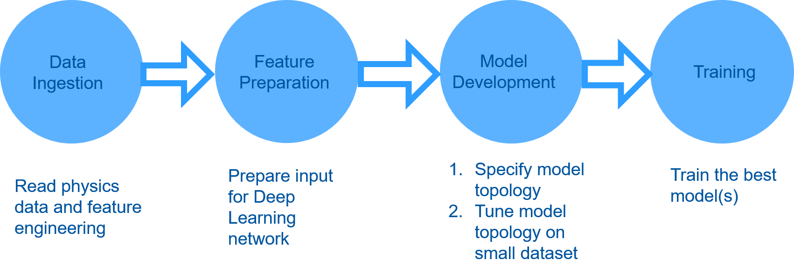
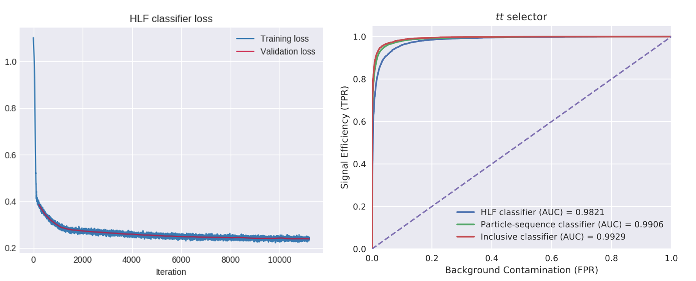

# SparkDLTrigger

This repository contains code, notebooks, and links to the datasets accompanying
- The article [Machine Learning Pipelines with Modern Big DataTools for High Energy Physics](https://arxiv.org/abs/1909.10389)
- Blog entries:
  - [Machine Learning Pipelines for High Energy Physics Using Apache Spark with BigDL and Analytics Zoo](https://db-blog.web.cern.ch/blog/luca-canali/machine-learning-pipelines-high-energy-physics-using-apache-spark-bigdl)    
  - [Distributed Deep Learning for Physics with TensorFlow and Kubernetes](https://db-blog.web.cern.ch/blog/luca-canali/2020-03-distributed-deep-learning-physics-tensorflow-and-kubernetes)

Authors and credits:  
- Principal author of the notebooks: Matteo.Migliorini@cern.ch  
- Authors and contacts: Luca.Canali@cern.ch; Riccardo.Castellotti@cern.ch; Matteo.Migliorini@cern.ch  
- Original research article, raw data and neural network models by: [T.Q. Nguyen *et al.*, Comput Softw Big Sci (2019) 3: 12](https://link.springer.com/epdf/10.1007/s41781-019-0028-1?author_access_token=eTrqfrCuFIP2vF4nDLnFfPe4RwlQNchNByi7wbcMAY7NPT1w8XxcX1ECT83E92HWx9dJzh9T9_y5Vfi9oc80ZXe7hp7PAj21GjdEF2hlNWXYAkFiNn--k5gFtNRj6avm0UukUt9M9hAH_j4UR7eR-g%3D%3D)   
- Acknowledgements: Viktor Khristenko, Thong Nguyen, Maurizio Pierini, Maria Girone, Marco Zanetti, 
members of the Hadoop and Spark service at CERN, CMS Bigdata project,
Intel team for BigDL and Analytics Zoo consultancy: Jiao (Jennie) Wang and Sajan Govindan.

## Data and Code
Data and code to reproduce this work are made available via this repository.
- [Datasets: links to download and short description](Data)
- Notebooks with [data preparation code using Apache Spark](DataIngestion_FeaturePreparation)
- Notebooks with machine learning training
  - Distributed DL training with [Apache Spark and BigDL/AnalyticsZoo](Training_BigDL_Zoo)
  - Training DL models with TensorFlow (tf.keras):
    - [tf.keras on CPU](Training_TFKeras_CPU), multiple methods
    - [tf.keras with GPU](Training_TFKeras_GPU)
    - [Distributed tf.keras on CPU](Training_TFKeras_CPU_Distributed)
    - [Distributed tf.keras on CPU and GPU using Kubernetes](Training_TFKeras_CPU_GPU_K8S_Distributed)
    - [Saved models](Models)
  - Other ML training: [using Spark ML](Training_Other_ML)  
  
## Physics Use Case
Event data flows collected from the particle detector (CMS experiment) contains different types
of event topologies of interest. 
A particle classifier built with neural networks can be used as event filter,
improving state of the art in accuracy.  
This work reproduces the findings of the paper
[Topology classification with deep learning to improve real-time event selection at the LHC](https://link.springer.com/epdf/10.1007/s41781-019-0028-1?author_access_token=eTrqfrCuFIP2vF4nDLnFfPe4RwlQNchNByi7wbcMAY7NPT1w8XxcX1ECT83E92HWx9dJzh9T9_y5Vfi9oc80ZXe7hp7PAj21GjdEF2hlNWXYAkFiNn--k5gFtNRj6avm0UukUt9M9hAH_j4UR7eR-g%3D%3D)
using tools from the Big Data ecosystem, notably Apache Spark and BigDL/Analytics Zoo.  

  
## Data Pipelines for Deep Learning
Data pipelines are of paramount importance to make machine learning projects successful, by integrating multiple components and APIs used for data processing across the entire data chain. A good data pipeline implementation can accelerate and improve the productivity of the work around the core machine learning tasks.
The four steps of the pipeline we built are:

- Data Ingestion: where we read data from ROOT format and from the CERN-EOS storage system, into a Spark DataFrame and save the results as a table stored in Apache Parquet files
- Feature Engineering and Event Selection: where the Parquet files containing all the events details processed in Data Ingestion are filtered and datasets with new  features are produced
- Parameter Tuning: where the best set of hyperparameters for each model architecture are found performing a grid search
- Training: where the best models found in the previous step are trained on the entire dataset.

  
## Results
The results of the DL model(s) training are satisfactoy and match the results of the original research paper. 

## Additional Info and References
- [Article "Machine Learning Pipelines with Modern Big DataTools for High Energy Physics"](https://arxiv.org/abs/1909.10389)
- [Blog post "Machine Learning Pipelines for High Energy Physics Using Apache Spark with BigDL and Analytics Zoo"](https://db-blog.web.cern.ch/blog/luca-canali/machine-learning-pipelines-high-energy-physics-using-apache-spark-bigdl)
- [Poster at the CERN openlab technical workshop 2019](Docs/Poster.pdf)  
- [Presentation at Spark Summit SF 2019](https://databricks.com/session/deep-learning-on-apache-spark-at-cerns-large-hadron-collider-with-intel-technologies)  
- [Presentation at CERN EP-IT Data science seminar](https://indico.cern.ch/event/859119/)
